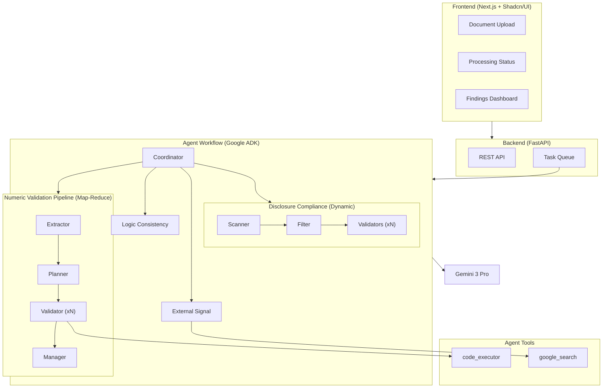

# Veritas AI — Implementation Plan

High-level architecture and implementation plan for the multi-agent AI co-auditor system.

## Decisions Confirmed

- ✅ **Deployment Target**: Google Cloud (Cloud Run for backend, Cloud Storage for documents)
- ✅ **External Data Sources**: Gemini 3 Pro's built-in Google Search tool (no separate API needed)

---

## Proposed Architecture



---

## Project Structure

```
veritas-ai/
├── frontend/                          # Next.js 14+ App
│   ├── app/
│   │   ├── layout.tsx
│   │   ├── page.tsx                   # Upload screen
│   │   └── jobs/
│   │       └── [id]/
│   │           ├── page.tsx           # Status + Findings dashboard
│   │           └── findings/
│   │               └── [findingId]/
│   │                   └── page.tsx   # Drill-down view
│   ├── components/
│   │   ├── upload/
│   │   ├── findings/
│   │   └── common/
│   ├── lib/
│   │   └── api-client.ts
│   └── package.json
│
├── backend/                           # FastAPI Application
│   ├── app/
│   │   ├── main.py                    # FastAPI app entry
│   │   ├── config.py                  # Settings/env vars
│   │   ├── api/
│   │   │   ├── routes/
│   │   │   │   ├── upload.py          # POST /api/upload
│   │   │   │   ├── jobs.py            # GET /api/jobs/{id}
│   │   │   │   └── findings.py        # GET /api/jobs/{id}/findings
│   │   │   └── websocket.py           # WebSocket for status updates
│   │   ├── agents/                    # Google ADK Agents
│   │   │   ├── coordinator.py         # Orchestration + deduplication
│   │   │   ├── numeric_validation/    # Numeric Validation Pipeline
│   │   │   │   ├── extractor.py       # .docx → markdown (uses python-docx)
│   │   │   │   ├── planner.py         # Creates validation checklist
│   │   │   │   └── validator.py       # Executes checks (uses code_executor)
│   │   │   ├── logic_consistency.py   # Semantic inconsistencies
│   │   │   ├── disclosure_compliance.py  # IFRS checklist validation
│   │   │   └── external_signal.py     # News search (uses google_search)
│   │   ├── config/
│   │   │   └── ifrs_checklists/       # YAML disclosure checklists
│   │   │       ├── ias_1.yaml
│   │   │       ├── ifrs_7.yaml
│   │   │       └── ias_24.yaml
│   │   ├── models/
│   │   │   ├── job.py                 # Job/session model
│   │   │   ├── finding.py             # Finding model
│   │   │   └── document.py            # Document metadata
│   │   └── services/
│   │       ├── storage.py             # GCS operations
│   │       └── queue.py               # Task queue operations
│   ├── requirements.txt
│   └── Dockerfile
│
├── docker-compose.yml                 # Local development
└── README.md
```

> **Note**: The `tools/` folder was removed. Agent tools like `code_executor` and `google_search` are provided by Google ADK. Document parsing (`python-docx`) is called directly within `extractor.py`.

---

## Proposed Changes

### Frontend (Next.js)

#### [NEW] [frontend/](file:///Users/orkhan/Documents/dev/veritas-ai/frontend)

Complete Next.js 14 application with:
- **Upload Page**: Drag-and-drop .docx upload with file validation
- **Jobs Page**: Real-time processing status via WebSocket, agent progress indicators
- **Findings Dashboard**: Filterable/sortable list by severity, category
- **Drill-down View**: Source citations with document references

**Key Dependencies**:
- `next` 14.x
- `@tanstack/react-query` for API state
- WebSocket client for real-time updates

**UI Component Strategy**:

| Option | Pros | Cons | Verdict |
|--------|------|------|---------|
| **Shadcn/UI** | Accessible (Radix), own the code, great DX | Requires Tailwind CSS | ✅ **Recommended** |
| **Radix UI (raw)** | Maximum flexibility | More work to style | Overkill for MVP |
| **Material UI** | Complete, familiar | Heavy, opinionated, harder to customize | Not ideal |
| **Vanilla CSS** | Full control | Slower to build dashboard UI | Not ideal for MVP speed |

> **Recommendation: Use Shadcn/UI.** For a dashboard with tables, filters, and drill-downs, Shadcn provides exactly the right components (DataTable, Sheet, Dialog) with excellent accessibility. The Tailwind requirement is acceptable here since we need rapid iteration on a complex UI. You own the component code, so no vendor lock-in.

---

### Backend (FastAPI)

#### [NEW] [backend/](file:///Users/orkhan/Documents/dev/veritas-ai/backend)

FastAPI application with async support:

| Endpoint | Method | Description |
|----------|--------|-------------|
| `/api/upload` | POST | Upload .docx files, returns job ID |
| `/api/jobs/{id}` | GET | Job status and metadata |
| `/api/jobs/{id}/findings` | GET | Paginated findings list |
| `/api/ws/jobs/{id}` | WS | Real-time status updates |

**Key Dependencies**:
- `fastapi`, `uvicorn`
- `python-docx` for .docx parsing
- `pandas` for table operations
- `google-adk` for agent orchestration
- `google-genai` for Gemini 3 Pro
- `sqlalchemy` + `asyncpg` for PostgreSQL
- `google-cloud-storage` for GCS

---

### Coordinator Agent

#### [NEW] [coordinator.py](file:///Users/orkhan/Documents/dev/veritas-ai/backend/app/agents/coordinator.py)

The orchestration layer that manages the entire analysis workflow.

**Responsibilities:**

| Task | Description |
|------|-------------|
| **Invoke agents** | Calls each agent with the extracted document |
| **Parallelize** | Runs Logic, Disclosure, External in parallel (independent) |
| **Aggregate** | Collects findings from all agents into one list |
| **Deduplicate** | Merges overlapping issues (e.g., same error from multiple agents) |
| **Severity scoring** | Assigns final HIGH/MEDIUM/LOW based on agent outputs |
| **Status updates** | Emits progress events for WebSocket |

**Google ADK Implementation:**
```python
from google.adk import Agent, SequentialAgent, ParallelAgent

# Numeric Pipeline runs sequentially
numeric_pipeline = SequentialAgent(
    agents=[extractor, planner, validator]
)

# Top-level: pipeline + other agents in parallel
coordinator = ParallelAgent(
    agents=[
        numeric_pipeline,
        logic_consistency,
        disclosure_compliance,
        external_signal,
    ],
    post_process=aggregate_and_dedupe
)
```

---

### Agent Workflow (Numeric Validation Pipeline - Map/Reduce)

```
┌──────────────────────────────────────────────────────────────────────────────────┐
│                      NUMERIC VALIDATION PIPELINE (Map-Reduce)                    │
├──────────────────────────────────────────────────────────────────────────────────┤
│                                                                                  │
│  ┌──────────────┐   ┌──────────────┐   ┌──────────────────────────────┐          │
│  │ 1. EXTRACTOR │──▶│  2. PLANNER  │──▶│         3. VALIDATOR         │          │
│  │              │   │              │   │ (Spawns 1 sub-agent per FSL) │          │
│  │ .docx → text │   │ "Identify    │   │ ┌──────┐ ┌──────┐ ┌──────┐   │          │
│  │ (structured) │   │  all FSLIs"  │   │ │ Cash │ │ Rev. │ │ PPE  │   │          │
│  └──────────────┘   └──────┬───────┘   │ └──────┘ └──────┘ └──────┘   │          │
│                            │           └──────────────┬───────────────┘          │
│                            │                          │                          │
│                            ▼                          ▼                          │
│                     ["Cash", "Revenue",    ┌──────────────────────────────┐      │
│                      "Inventory", "PPE"]   │          4. MANAGER          │      │
│                                            │  (Aggregates + QC Checks)    │      │
│                                            └──────────────────────────────┘      │
│                                                                                  │
└──────────────────────────────────────────────────────────────────────────────────┘
```

#### [NEW] [extractor.py](file:///Users/orkhan/Documents/dev/veritas-ai/backend/app/agents/numeric_validation/extractor.py)

Converts .docx to structured text format optimized for Gemini.
- Preserves table structure in markdown format
- Maintains section hierarchy

#### [NEW] [planner.py](file:///Users/orkhan/Documents/dev/veritas-ai/backend/app/agents/numeric_validation/planner.py)

**Role**: The "Audit Manager".

**Agent Goal**: Scan the document and identify all distinct Financial Statement Line Items (FSLIs) that require validation.

**Output**: List of categories to parallelize.
```json
{
  "fsl_categories": [
    "Cash and Cash Equivalents",
    "Accounts Receivable",
    "Property, Plant & Equipment",
    "Revenue",
    "Leases"
  ]
}
```

#### [NEW] [validator.py](file:///Users/orkhan/Documents/dev/veritas-ai/backend/app/agents/numeric_validation/validator.py)

**Role**: The "Audit Team" (runs in parallel for each FSLI).

**Input**: Full document + specific `fsl_category` (e.g., "Cash").

**Process**:
1. Scan document for all mentions/tables related to the assigned FSLI.
2. Formulate equations to check consistency (e.g., Opening + Inflows - Outflows = Closing).
3. Execute equations via `code_executor`.
4. Return findings for that specific FSLI.

**Output**:
```json
{
  "category": "Cash and Cash Equivalents",
  "findings": [
    {
      "id": "VAL-CASH-001",
      "description": "Cash Flow statement closing balance mismatch with Balance Sheet",
      "severity": "high"
    }
  ]
}
```

#### [NEW] [manager.py](file:///Users/orkhan/Documents/dev/veritas-ai/backend/app/agents/numeric_validation/manager.py)

**Role**: The "Partner Review".

**Agent Goal**: Synthesize parallel outputs and perform quality control.

**Process**:
1. Aggregate findings from all Validator sub-agents.
2. **Double Confirm**: Check for conflicting findings (e.g. Validator A says X is correct, Validator B says X is wrong).
3. **Summarize**: Create a cohesive list of numeric issues.

> **Why parallelize?** Reduces context noise for the LLM (it only focuses on "Cash" or "Revenue" at a time), isolates hallucinations, and speeds up processing.

#### [NEW] [agents/logic_consistency.py](file:///Users/orkhan/Documents/dev/veritas-ai/backend/app/agents/logic_consistency.py)

**Gemini 3 Pro (no tools)** — detects semantic inconsistencies that are logically unreasonable even if numerically correct.

| Check Type | Example |
|------------|---------|
| **Cash flow vs assets** | $5M equipment purchases reported, but only $500K capex in cash flow |
| **Unexplained variances** | Gross margin jumps 25% → 45% with no MD&A explanation |
| **Related-party depth** | $10M CEO loan mentioned in one line; IFRS requires terms/rates |
| **Going-concern signals** | Negative working capital + losses, but no disclosure |

**Input**: Extracted document (same markdown used by Planner)

**Output**:
```json
{
  "findings": [
    {
      "id": "LOGIC-001",
      "category": "logical",
      "severity": "high",
      "description": "Revenue increased 40% YoY but no explanation in MD&A",
      "source_refs": ["Table 2: Income Statement", "Section 5: MD&A"],
      "reasoning": "Revenue grew from $8.2M to $11.5M (40%). MD&A mentions 'continued growth' but provides no specific drivers. This lacks specificity expected under IAS 1."
    }
  ]
}
```

> **Key difference from Validator**: Validator checks math (deterministic). Logic Consistency checks *reasonableness* (LLM reasoning). Each finding includes a `reasoning` trail for audit traceability.

#### [NEW] [agents/disclosure_compliance.py](file:///Users/orkhan/Documents/dev/veritas-ai/backend/app/agents/disclosure_compliance.py)

**Dynamic Workflow: Scan → Filter → Validate**

```
┌──────────────────────────────────────────────────────────────────────────────┐
│                  DISCLOSURE COMPLIANCE PIPELINE (Dynamic)                    │
├──────────────────────────────────────────────────────────────────────────────┤
│                                                                              │
│  ┌──────────────┐     ┌──────────────┐    ┌──────────────────────────────┐   │
│  │  1. SCANNER  │────▶│  2. FILTER   │───▶│       3. VALIDATORS          │   │
│  │    (LLM)     │     │    (Code)    │    │ (Spawns 1 per Standard)      │   │
│  │ "Which IFRS  │     │ Selects YAML │    │ ┌──────┐ ┌──────┐ ┌──────┐   │   │
│  │  apply?"     │     │ checklists   │    │ │IAS 1 │ │IFRS15│ │IFRS16│   │   │
│  └──────┬───────┘     └──────┬───────┘    │ └──────┘ └──────┘ └──────┘   │   │
│         │                    │            └──────────────────────────────┘   │
│         ▼                    ▼                                               │
│   ["IAS 1", "IAS 16",   [ias_1.yaml,                                         │
│    "IFRS 15"]            ifrs_15.yaml]                                       │
│                                                                              │
└──────────────────────────────────────────────────────────────────────────────┘
```

**Step 1: Scanner (Gemini 3 Pro)**
- Reads report to identify business activities.
- Outputs list of applicable standards (e.g., "Company leases offices -> **IFRS 16** applies").

**Step 2: Filter (Python Rule Engine)**
- Loads all available YAML checklists from `config/ifrs_checklists/`.
- filters for only those identified in Step 1.
- *Fallback*: Always includes mandatory standards (IAS 1, IAS 7, IAS 8).

**Step 3: Validators (Parallel Agents)**
- Spawns parallel sub-agents for each applicable standard.
- Each agent receives the specific YAML checklist + document.
- **Output**: Compliance findings for that standard.

**Example YAML checklist** (`config/ifrs_checklists/ias_24.yaml`):
```yaml
standard: IAS 24
version: "2024-01"
requirements:
  - id: IAS24-001
    description: "Parent entity name disclosed"
    question: "Is the parent company name disclosed?"
    severity_if_missing: high
```

> **Optimization**: Avoids running 50+ irrelevant standard checks (e.g., "Biological Assets" for a SaaS company).

#### [NEW] [agents/external_signal.py](file:///Users/orkhan/Documents/dev/veritas-ai/backend/app/agents/external_signal.py)

**Uses Gemini 3 Pro + Google Search Tool** — scans external sources:
- Financial distress indicators for the company
- Litigation or regulatory actions
- Restructuring or going-concern signals

> The agent uses Gemini's native `google_search` tool, so no separate API integration is needed. The agent prompts Gemini to search for relevant news and evaluate contradictions against the financial statement disclosures.

---

## Phased Build Approach

### Phase 1: Foundation (Week 1-2)
- [ ] Project scaffolding (Next.js + FastAPI)
- [ ] File upload flow (frontend → backend → GCS)
- [ ] Document parser tool (`python-docx`)
- [ ] Basic job tracking (PostgreSQL)

### Phase 2: Core Agents (Week 3-4)
- [ ] Numeric Validator agent (deterministic)
- [ ] Coordinator agent (Google ADK setup)
- [ ] Findings storage and API

### Phase 3: LLM Agents (Week 5-6)
- [ ] Logic Consistency agent (Gemini 3 Pro)
- [ ] Disclosure Compliance agent
- [ ] Real-time status updates (WebSocket)

### Phase 4: Polish (Week 7-8)
- [ ] Findings dashboard UI
- [ ] Drill-down with source citations
- [ ] Error handling and edge cases

---

## Verification Plan

### Automated Tests

Since this is a new project, we will need to create tests from scratch:

**Backend Tests** (pytest):
```bash
cd backend
pytest tests/ -v
```
- Unit tests for `docx_parser.py` with sample .docx files
- Unit tests for `numeric_validator.py` with known table data
- Integration tests for agent orchestration

**Frontend Tests** (Vitest/Jest):
```bash
cd frontend
npm run test
```
- Component tests for upload, findings display
- API client tests with mocked responses

### Manual Verification

1. **Upload Flow**: Upload a sample financial statement (.docx) and verify:
   - File appears in GCS
   - Job record created in PostgreSQL
   - Status updates via WebSocket

2. **Numeric Validation**: Upload a document with intentional math errors:
   - Verify errors are detected and flagged
   - Check severity assignment accuracy

3. **End-to-End**: Process a complete financial statement:
   - Verify all agents run successfully
   - Check findings report completeness
   - Verify source citations are accurate

> [!NOTE]
> We will need sample .docx financial statements for testing. These can be synthetic documents with known errors.
