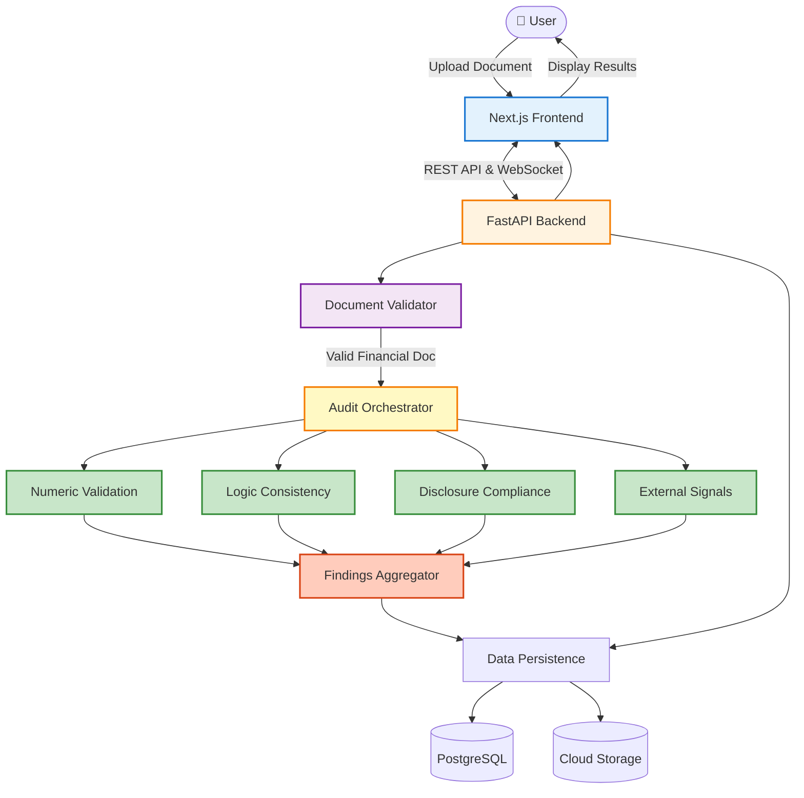

<div align="center">
  
</div>

<h1 align="center">Veritas AI</h1>

<p align="center">
  <strong>The AI Co-Auditor That Eliminates Inconsistencies in Financial Reports</strong>
</p>

<p align="center">
  Automated validation of financial reports using multi-agent AI — because manual reconciliation across 100+ page documents doesn't scale.
</p>

---

## The Problem

Financial auditing faces a critical challenge that hasn't been solved by traditional software:

**Financial statements are complex documents with deeply interconnected data**. A single error in one table can cascade across footnotes, disclosures, management discussions, and other statements. Yet auditors are still manually cross-referencing hundreds of pages to find these inconsistencies.

### Specific Pain Points

1. **In-Table & Cross-Table Reconciliation is Manual, Tedious and Error-Prone**
   - Totals and subtotals within a table must match the sum of their components
   - Income Statement figures must tie to Cash Flow Statements
   - Footnote disclosures must match primary statement line items
   - MD&A narratives must align with actual financial data
   - One analyst can spend days just on cross-referencing

2. **Logical Contradictions Go Unnoticed**
   - Text says "revenue increased 15%" but tables show 8% decline
   - Seasonal business patterns ignored in year-over-year comparisons
   - Industry-specific accounting treatments misapplied
   - These require domain expertise AND tedious verification

3. **Regulatory Compliance is a Moving Target**
   - IFRS/IAS standards require specific disclosures
   - Missing a single disclosure requirement = audit failure
   - Checklists are static; business contexts are dynamic
   - Manual verification is time-consuming and incomplete

4. **External Events Slip Through the Cracks**
   - Public lawsuits, regulatory actions, or material acquisitions
   - Often disclosed in press releases but missing from financials
   - Requires continuous monitoring of multiple external sources
   - Impossible to scale without automation

**The cost?** Delayed audits, regulatory penalties, reputational damage, and — worst case — investor lawsuits from material misstatements.

---

## Why Existing Solutions Fall Short

### Traditional Audit Software

Traditional tools focus on **data extraction and sampling**. They can detect mathematical errors within a single dataset, but they can't:
- Understand semantic relationships between tables, text and numbers
- Detect logical contradictions across document sections
- Adapt to context-specific accounting treatments
- Verify external claims against authoritative sources

**Bottom line:** They're glorified spreadsheet analyzers, not intelligent co-auditors.

### Single-Agent LLM Approaches

Throwing a single ChatGPT or Gemini prompt at a even simple complexity financial report hits immediate limits:
- **Context overwhelming**: Even with 1M context window, models struggle to keep track of all the details in a financial report
- **Hallucination risk**: A single model making both math calculations and semantic judgments amplifies errors
- **No specialization**: One prompt can't simultaneously handle IFRS compliance, cross-table math, logic checks, and web research
- **No verification**: LLM output is unverified — you're trusting a black box with high-stakes financial validation

**Bottom line:** Single agents are generalists in a domain that demands specialized expertise.

---

## How Veritas AI is Different

Veritas AI uses a **multi-agent orchestration architecture** where autonomous specialist agents collaborate to validate financial reports. Think of it as assembling a virtual audit team — each agent has a specific expertise, its own tools, and a defined validation mandate.

### The Multi-Agent Advantage

| Capability | Traditional Tools | Single-Agent LLM | Veritas AI |
|-----------|------------------|------------------|------------|
| **Mathematical Validation** | Limited to single tables | Hallucination-prone | Deterministic Python engine + LLM reasoning |
| **Semantic Understanding** | None | Basic | Multi-pass refinement with context specialization |
| **Regulatory Compliance** | Static checklists | Generic | Dynamic standard detection + focused verification |
| **External Verification** | Manual | Not possible | Autonomous web research with source attribution |
| **Scalability** | Linear with document size | Context window limits | Parallel processing across agents |
| **Verification** | Human review | None | Every finding reviewed by specialist agent |

### Core Design Principles

1. **Deterministic Tools Own the Numbers, LLMs Own the Meaning**
   - Mathematical calculations run in Python (zero hallucination risk)
   - LLMs generate formula templates; deterministic engine executes them
   - Semantic analysis and contradiction detection reserved for language models

2. **Parallel Specialization Over Monolithic Reasoning**
   - Four independent validation pipelines run simultaneously
   - Each pipeline has its own sub-agents, tools, and verification loops
   - Findings aggregated and deduplicated at the orchestrator level

3. **Multi-Pass Refinement for Subtle Issues**
   - Logic Consistency Agent uses 3 chains × 3 passes — each pass refines the previous
   - Cross-Table Numeric checks use Map-Reduce with reviewer verification
   - Disclosure Compliance dynamically creates one agent per applicable standard

4. **External Grounding Prevents Insular Analysis**
   - External Signal Agent autonomously researches company events
   - Bidirectional verification: report → internet AND internet → report
   - All findings reconciled against actual financial statement disclosures

---

## Key Features

### Numeric Validation
- **In-Table Checks**: Verify row/column sums, rollforwards, percentage calculations
- **Cross-Table Reconciliation**: Ensure Net Income, Cash Flow, and Balance Sheet consistency
- **Anchor Formula Pattern**: LLM generates one formula template, Python replicates across all rows/columns

### Logic Consistency Detection
- **Narrative-to-Data Mismatches**: "Revenue increased" vs. actual decrease in tables
- **Business Logic Violations**: Impossible scenarios (negative depreciation, etc.)
- **Temporal Inconsistencies**: Year-over-year comparisons that ignore seasonal effects
- **Multi-Pass Refinement**: 3 independent chains, 3 sequential refinement passes each

### Disclosure Compliance (IFRS/IAS)
- **Dynamic Standard Detection**: Identifies which IFRS/IAS standards apply to the business
- **Focused Verification**: One ephemeral agent per standard with targeted checklist
- **False Positive Filtering**: Detects semantic equivalence and combined disclosures

### External Signal Verification
- **Gemini Deep Research Integration**: Autonomous web browsing with multi-source synthesis
- **Bidirectional Validation**: Verify report claims AND discover undisclosed events
- **Authoritative Source Matching**: Corporate registries, IMF, World Bank, regulatory filings

### Document Intelligence
- **Upfront Validation**: Fast deterministic checks + lightweight LLM classifier
- **Cost Optimization**: Rejects non-financial documents before expensive pipeline runs
- **Real-Time Progress Tracking**: WebSocket-based live updates during validation

---

## Architecture

### High-Level System Design



### Deep-Dive Technical Documentation

For detailed architecture diagrams and implementation patterns, see:
- **[Backend API Documentation](backend/README.md)** — FastAPI routes, database models, deployment guides
- **[Multi-Agent System Architecture](backend/agents/README.md)** — Agent pipelines, reasoning patterns, model selection
- **[Frontend Documentation](frontend/README.md)** — Next.js app structure, component library, state management

---

### Project Structure

```
veritas-ai/
├── backend/                    # Python backend
│   ├── agents/                 # Multi-agent system (Google ADK)
│   │   └── veritas_ai_agent/   # Main agent package
│   │       ├── agent.py        # Orchestrator
│   │       ├── sub_agents/     # Specialized validation agents
│   ├── app/                    # FastAPI application
│   │   ├── api/                # REST endpoints
│   │   ├── models/             # Database models
│   │   ├── schemas/            # Pydantic schemas
│   │   └── services/           # Business logic
│   └── alembic/                # Database migrations
├── frontend/                   # Next.js frontend
│   ├── app/                    # App Router pages
│   ├── components/             # React components
│   └── lib/                    # Utilities
└── .docs/                      # Product documentation
```

---

## Quick Start

### Prerequisites

- **Python 3.11+** with [uv](https://astral.sh/uv/) package manager
- **Node.js 18+** for frontend
- **Docker** for local PostgreSQL database
- **Google Cloud credentials** (for Gemini API access)

### 1. Clone and Install

```bash
git clone https://github.com/your-org/veritas-ai.git
cd veritas-ai
make install
```

This installs all dependencies for both backend and frontend.

### 2. Environment Configuration

```bash
# Backend environment
cp backend/.env.example backend/.env
cp backend/agents/.env.example backend/agents/.env

# Edit backend/.env with your configuration:
# - DATABASE_URL (PostgreSQL connection)
# - GCS_BUCKET (optional, for cloud storage)
# - GEMINI_API_KEY (required for AI agents)
```

### 3. Start Development Environment

```bash
# Start database, apply migrations, and launch both servers
make dev
```

This will:
1. Start PostgreSQL in Docker
2. Run database migrations
3. Launch FastAPI backend on `http://localhost:8000`
4. Launch Next.js frontend on `http://localhost:3000`

### 4. Test the Agent Playground (Optional)

```bash
cd backend/agents
make playground
# Opens at http://localhost:8501
```

Upload a financial report (Markdown format) and type "Analyze this report" to see the multi-agent system in action.

### Main Commands

```bash
# Install all dependencies
make install

# Run development servers (backend + frontend)
make dev

# Run tests (backend + agents + frontend)
make test

# Lint and format code
make lint

# Deploy to Google Cloud Run
make deploy

# Agent playground (interactive testing)
cd backend/agents && make playground
```

---

## Tech Stack

### Backend
- **Agent Framework**: [Google ADK](https://github.com/google/adk-python) (Agent Development Kit)
- **AI Models**: Gemini 3 Pro/Flash + Deep Research
- **API**: FastAPI with async/await
- **Database**: PostgreSQL 15 + SQLAlchemy 2.0 (async)
- **Storage**: Google Cloud Storage
- **Package Manager**: [uv](https://astral.sh/uv) (fast Python package manager)
- **Testing**: pytest with async support

### Frontend
- **Framework**: Next.js 16 (App Router)
- **Language**: TypeScript 5
- **Styling**: Tailwind CSS 4
- **UI Components**: Radix UI + shadcn/ui
- **State Management**: TanStack Query
- **Real-Time**: WebSocket integration

### Infrastructure
- **Containerization**: Docker + Docker Compose
- **Deployment**: Google Cloud Run
- **Migrations**: Alembic
- **Code Quality**: Ruff (linting + formatting), ESLint, pre-commit hooks

---

<p align="center">
  <sub>Built with Google ADK, Gemini 3, Next.js, and FastAPI</sub>
</p>
