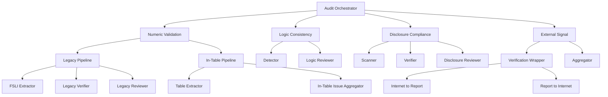

# Veritas AI Agent 🛡️

Veritas AI Agent is a high-performance, multi-agent orchestrator designed to automate the validation and fact-checking of financial reports. Built on the **Google Agent Development Kit (ADK)**, it leverages Gemini models to perform deep analysis, mathematical verification, and external signal cross-referencing.

## 🚀 Overview

The agent operates as a specialized "Audit Orchestrator" that coordinates several expert sub-agents to ensure the integrity of financial disclosures. It is designed to handle complex documents, perform precise calculations, and verify claims against real-world data via Deep Research.

### Key Capabilities

*   **🔢 Numeric Validation**: Performs parallel validation using a **Legacy Pipeline** (extracting FSLIs for checks) and an **In-Table Pipeline** (verifying internal calculations within tables).
*   **⚖️ Logic Consistency**: Detects contradictions between different sections of a report (e.g., Narrative vs. Data).
*   **📋 Disclosure Compliance**: Scans reports against IFRS/IAS standards to identify missing or non-compliant disclosures.
*   **🌐 External Signal Verification**: Uses **Gemini Deep Research** to cross-verify report claims against internet sources and historical data.

## 🏗️ Architecture

The system follows a hierarchical agent structure:



## 🛠️ Technology Stack

*   **Framework**: [Google ADK](https://github.com/google/adk)
*   **Models**: Gemini 3 Pro/Flash (via Vertex AI)
*   **Tooling**: `uv` (Package Management), `pytest`, `ruff` (Style/Lint)
*   **Deployment**: Google Cloud Run

## 📥 Getting Started

### Prerequisites

*   Python 3.10+
*   [uv](https://astral.sh/uv/) package manager
*   Google Cloud Project with Vertex AI and Gemini API enabled

### Installation

```bash
# Clone the repository and navigate to the agent directory
cd backend/agents

# Install dependencies and sync virtual environment
make install
```

### Configuration

Create a `.env` file in the root directory:

```env
PROJECT_ID=your-gcp-project-id
LOCATION=us-central1
LOGS_BUCKET_NAME=your-telemetry-bucket
```

## 🖥️ Usage

### Local Development

Run the interactive playground to chat with the agent and view traces:

```bash
make playground
```

Start the FastAPI backend with hot-reload:

```bash
make local-backend
```

### Testing & Quality

```bash
# Run unit and integration tests
make test

# Run linting and type checks
make lint
```

## ☁️ Deployment

The agent is designed to be deployed to **Google Cloud Run** using the ADK CLI.

```bash
# Deploy to the configured GCP project
make deploy
```
