# Veritas AI Agent Validation Pipeline 🛡️

The Veritas AI Agent is a sophisticated multi-agent system designed to automate the audit and validation of financial reports. It leverages the **Google Agent Development Kit (ADK)** and **Gemini 3.0 Pro/Flash** models to perform distinct types of validation in parallel, orchestrating a team of specialized sub-agents.

## 🌟 High-Level Overview

The system is built as a **sophisticated Multi-Agent System (MAS)**, where autonomous agents collaborate to decompose the complex task of financial auditing into manageable, specialized domains. Unlike monolithic approaches, this architecture allows each agent to employ distinct reasoning strategies—such as Map-Reduce for large datasets, multi-pass refinement for subtle logic checks, and recursive research for external validation.

Before any audit work begins, a **Document Validator** acts as a cost-efficient gate. It combines fast deterministic pre-flight checks (content length, presence of tabular data) with a lightweight LLM classifier to reject documents that are clearly not financial in nature — preventing the expensive downstream pipeline from running on irrelevant uploads.

At the core is the **Audit Orchestrator**, a central hub that dispatches the financial report to four parallel expert pipelines. Each pipeline operates independently with its own tools and sub-agents, focusing on a specific validation vertical (Numeric, Logic, Compliance, and External Signals). The Orchestrator then aggregates their independent findings into a single, comprehensive audit report.

### Architecture Diagram


---

## 🔍 Deep Dive: Agent Pipelines

### 0. Document Validator
**Goal**: Prevent non-financial documents from entering the expensive audit pipeline.

Running four parallel audit agents on an irrelevant document wastes significant compute and returns meaningless results. The Document Validator sits at the very front of the pipeline to short-circuit early when a document is clearly not a financial report.

**What's special**: Uses a two-layer strategy — fast deterministic pre-flight checks (content length, presence of tabular data) catch obviously invalid uploads before a lightweight LLM classifier handles the semantic classification. The LLM is biased toward acceptance ("when in doubt, accept") to minimize false rejections. If the document is rejected, the Audit Orchestrator is short-circuited and the four parallel agents never run.


---

### 1. Numeric Validation Agent
**Goal**: Verify that the numbers in the report add up — both within individual tables and across related tables.

This is the most complex pipeline. It first extracts tables programmatically (no LLM, zero hallucination risk), assigns semantic names via an LLM, then splits into two parallel streams:

-   **In-Table Pipeline**: Checks internal consistency within each table (column sums, row totals, rollforward logic). Uses **FanOut** to process tables in batches. An "anchor formula" pattern lets the LLM generate one formula template per table, which Python then replicates across all rows/columns deterministically — combining LLM reasoning with deterministic execution.
-   **Cross-Table Pipeline**: Checks relationships between tables (e.g., does Net Income on the Income Statement match the Cash Flow Statement?). Uses **MultiPassRefinement** detectors (one per financial statement type) to find subtle cross-references, followed by a **FanOut** reviewer to filter false positives.

An aggregator deduplicates findings from both streams and produces the final report.


---

### 2. Logic Consistency Agent
**Goal**: Find semantic contradictions — e.g., text says "revenue increased" but the table shows a decrease.

**What's special**: Uses **MultiPassRefinement** (3 parallel chains x 3 sequential passes) for the detection stage. Each pass sees the previous pass's findings and refines them, allowing the model to dig deeper into subtle contradictions that a single-shot prompt would miss. The three parallel chains explore independently to maximize coverage.

Detected contradictions include narrative-to-data mismatches, business logic violations, impossible scenarios, and temporal inconsistencies.

A **FanOut** reviewer then independently verifies each finding and assigns severity, filtering out false positives (e.g., industry-specific norms, seasonal effects).

```mermaid
graph TD
    Input[Orchestrator] --> Detector["Detector (MultiPassRefinement)<br/>3 chains × 3 passes"]
    Detector --> DetAgg[Detector Aggregator — Deduplicate]
    DetAgg --> Reviewer["Reviewer (FanOut)"]
    Reviewer --> Output[Verified Findings with Severity]
```



---

### 3. Disclosure Compliance Agent
**Goal**: Ensure the report adheres to IFRS/IAS accounting standards.

**What's special**: Uses **Dynamic FanOut** — the number of agents is not fixed at design time. A fast scanner first identifies which standards apply (e.g., "Company leases assets" → IFRS 16), then the verifier dynamically creates one ephemeral agent per applicable standard. Each agent receives a YAML checklist of disclosure requirements specific to its standard, ensuring focused verification without context pollution from other standards.

A reviewer filters false positives by detecting semantic equivalence, combined disclosures, and cross-references.


---

### 4. External Signal Agent
**Goal**: Verify report claims against the outside world, and discover external events the report may have missed.

**What's special**: Uses **Gemini Deep Research** — a model that autonomously browses the internet, synthesizes findings from multiple sources, and returns structured research reports. This is the only pipeline that reaches outside the document.

The verification is **bidirectional**:
1.  **Report → Internet**: Extracts verifiable facts from the report (incorporation dates, acquisitions, economic indicators, etc.) and checks them against authoritative sources (corporate registries, IMF, World Bank, etc.).
2.  **Internet → Report**: Independently searches for material signals about the company (lawsuits, regulatory actions, financing events, etc.) and checks whether they are adequately disclosed.

An aggregator reconciles all signals with the financial statement — properly disclosed items are filtered out, gaps are surfaced.


---

## 🧩 Shared Patterns

### `FanOutAgent`
Map-Reduce pattern: takes a list of items, spins up an ephemeral agent for each (with optional batching for rate limits), and aggregates results. Used by Numeric (table batches), Logic (finding review), Disclosure (one agent per standard), and Cross-Table (finding verification).

### `MultiPassRefinementAgent`
N parallel chains × M sequential passes: explores multiple lines of inquiry simultaneously, where each pass refines the previous pass's findings. Optimized for high-recall tasks where subtle issues are easily missed by a single prompt. Used by Logic Consistency (3×3) and Cross-Table detectors (1×3 and 2×3).

---

## 🤖 Models

The pipeline uses three Gemini models, chosen based on task complexity:

| Model | Used For |
|-------|----------|
| `gemini-3-pro-preview` | All reasoning-heavy agents — numeric checks, cross-table detection, logic consistency, disclosure verification, external signal verification, and reviewers |
| `gemini-3-flash-preview` | Lightweight tasks — document validation (classification), disclosure scanning (standard identification), and external signal aggregation |
| `deep-research-pro-preview` | External Signal agent — autonomous internet research with multi-source synthesis |

**Why two tiers?** Flash is faster and cheaper but less capable at complex reasoning. Pro is used wherever the agent needs to analyze financial data, detect subtle inconsistencies, or make nuanced judgments. Flash handles simple classification and aggregation tasks where speed matters more than depth.

---

## 🛠️ How to Build and Run

### Prerequisites
-   **Python 3.10+**
-   **[uv](https://astral.sh/uv/)** (Fast Python package manager)
-   **Gemini API Key** 

### 1. Installation
Clone the repo and install dependencies:
```bash
cd backend/agents
make install
```

### 2. Configuration
Create a `.env` file in `backend/agents/`:
```env
GEMINI_API_KEY=your-gemini-api-key
# Optional: Use specific mode
# VERITAS_AGENT_MODE=orchestrator
```

### 3. Run Locally (Playground)
Launch the ADK Playground to chat with the agent:
```bash
make playground
```
-   Open your browser to `http://localhost:8501`.
-   Upload a financial report in Markdown format.
-   Type "Analyze this report".

### 4. Deployment
Deploy to Google Cloud Run:
```bash
make deploy
```
