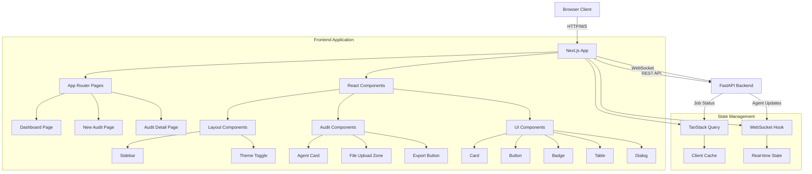

# Veritas AI Frontend

**Next.js-based web application for the Veritas AI co-auditor platform** — A modern, real-time interface for uploading financial reports and monitoring multi-agent validation results.

---

## 📖 Overview

The Veritas AI frontend provides an intuitive, responsive web interface for interacting with the AI-powered financial audit system. The application combines:

- **Document Upload**: Drag-and-drop interface for uploading financial reports (DOCX)
- **Real-Time Monitoring**: WebSocket-based live updates for agent processing status
- **Agent Results Display**: Color-coded cards showing findings from each validation agent
- **Export Functionality**: Export audit findings to CSV or PDF formats
- **Dark Mode Support**: System-aware theme switching with manual override
- **Audit History**: Sidebar navigation for managing multiple audit sessions

---

## 🏗️ Architecture



### Key Components

| Layer | Components | Description |
|-------|-----------|-------------|
| **Pages** | Dashboard, New Audit, Audit Detail | App Router pages with server/client rendering |
| **Layout** | Sidebar, Theme Toggle | Navigation and global UI controls |
| **Audit** | Agent Card, File Upload Zone, Export Button | Domain-specific audit components |
| **UI** | Card, Button, Badge, Table, Dialog | Reusable shadcn/ui components |
| **Hooks** | `use-audit-websocket`, `use-initial-audit-data` | Custom React hooks for state management |
| **API Client** | REST & WebSocket clients | Backend communication layer |
| **Utils** | Agent mapping, finding transformers | Data transformation utilities |

---

## 🛠️ Tech Stack

### Core Framework
- **[Next.js 16](https://nextjs.org/)** — React framework with App Router and Server Components
- **[React 19](https://react.dev/)** — UI library with concurrent rendering
- **[TypeScript 5](https://www.typescriptlang.org/)** — Type-safe JavaScript

### Styling & UI
- **[Tailwind CSS 4](https://tailwindcss.com/)** — Utility-first CSS framework
- **[shadcn/ui](https://ui.shadcn.com/)** — Beautifully designed components (Radix UI primitives)
- **[Lucide React](https://lucide.dev/)** — Icon library
- **[next-themes](https://github.com/pacocoursey/next-themes)** — Dark mode support

### State Management & Data Fetching
- **[TanStack Query v5](https://tanstack.com/query)** — Powerful async state management
- **[Zod](https://zod.dev/)** — TypeScript-first schema validation

### File Handling & Export
- **[react-dropzone](https://react-dropzone.js.org/)** — Drag-and-drop file uploads
- **[json2csv](https://github.com/zemirco/json2csv)** — CSV export functionality
- **[jsPDF](https://github.com/parallax/jsPDF)** — PDF generation
- **[jspdf-autotable](https://github.com/simonbengtsson/jsPDF-AutoTable)** — PDF table formatting

### Testing & Quality
- **[Playwright](https://playwright.dev/)** — End-to-end testing framework
- **[ESLint](https://eslint.org/)** — JavaScript linting

### Deployment
- **[Docker](https://www.docker.com/)** — Containerization with multi-stage builds
- **Google Cloud Run** — Serverless container platform

---

## 📥 Installation

### Prerequisites

- **Node.js 20+**
- **npm** or **pnpm** (package manager)
- **Backend API** running on `http://localhost:8000` (see [backend/README.md](../backend/README.md))

### 1. Install Dependencies

```bash
cd frontend
npm install
```

### 2. Environment Setup

Copy the example environment file and configure:

```bash
cp .env.example .env
```

Edit `.env` with your configuration:

```env
# Backend API URL
# Used by frontend to make HTTP requests to the FastAPI backend
# Default: http://localhost:8000
NEXT_PUBLIC_API_URL=http://localhost:8000
```

---

## 💻 Development

### Start the Development Server

```bash
npm run dev
```

This will:
1. Start the Next.js development server with hot-reload
2. Open the application at `http://localhost:3000`
3. Enable Fast Refresh for instant updates

### Available Scripts

| Script | Description |
|--------|-------------|
| `npm run dev` | Start development server |
| `npm run build` | Build production bundle |
| `npm start` | Start production server |
| `npm run lint` | Run ESLint |
| `npm run test:e2e` | Run Playwright E2E tests |
| `npm run test:e2e:ui` | Run E2E tests in UI mode |
| `npm run test:e2e:debug` | Run E2E tests in debug mode |

---

## 🔌 API Integration

### REST API Endpoints

The frontend communicates with the FastAPI backend via the following endpoints:

| Endpoint | Method | Description |
|----------|--------|-------------|
| `/api/v1/documents/upload` | POST | Upload document and create job |
| `/api/v1/jobs/` | GET | List all audit jobs |
| `/api/v1/jobs/{id}` | GET | Get job details |
| `/api/v1/jobs/{id}` | DELETE | Delete job |
| `/api/v1/jobs/{id}` | PATCH | Update job metadata |
| `/api/v1/jobs/{id}/results` | GET | Get all findings for job |
| `/api/v1/jobs/{id}/results/agent/{agent_id}` | GET | Get findings for specific agent |

**File**: `/lib/api.ts`

### WebSocket Connection

Real-time updates are delivered via WebSocket:

- **Endpoint**: `ws://localhost:8000/ws/audit/{jobId}`
- **Message Types**:
  - `agent_started`: Agent begins processing
  - `agent_completed`: Agent finishes processing
  - `audit_complete`: All agents finished

**File**: `/hooks/use-audit-websocket.ts`

### State Management

The application uses **TanStack Query** for server state management:

- **Caching**: Automatic caching and deduplication
- **Optimistic Updates**: Immediate UI updates before server confirmation
- **Invalidation**: Smart cache invalidation on mutations

**File**: `/lib/query-provider.tsx`

---

## 🧪 Testing

### End-to-End Tests

The frontend includes comprehensive E2E tests using Playwright:

```bash
# Install Playwright browsers
npx playwright install chromium

# Run all E2E tests
npm run test:e2e

# Run with UI (interactive)
npm run test:e2e:ui

# Run in debug mode
npm run test:e2e:debug
```
---

## 🐳 Docker & Deployment

### Local Docker Build

```bash
# Build the image
docker build -t veritas-frontend .

# Run the container
docker run -p 3000:3000 \
  -e NEXT_PUBLIC_API_URL=http://localhost:8000 \
  veritas-frontend
```

### Multi-Stage Build

The Dockerfile uses a multi-stage build for optimal production images:

1. **deps**: Install dependencies
2. **builder**: Build Next.js application
3. **runner**: Minimal production runtime

**File**: `Dockerfile`

```dockerfile
FROM node:20-alpine AS deps
RUN npm ci

FROM node:20-alpine AS builder
RUN npm run build

FROM node:20-alpine AS runner
COPY --from=builder /app/.next/standalone ./
CMD ["node", "server.js"]
```

### Deploy to Google Cloud Run

```bash
# Build and deploy
gcloud builds submit --config cloudbuild.yaml

# Or use the deployment script
./scripts/deploy.sh
```

**File**: `cloudbuild.yaml`

---

## ✨ Code Quality

### Linting

```bash
# Run ESLint
npm run lint

# Fix auto-fixable issues
npm run lint -- --fix
```

### TypeScript Type Checking

```bash
# Run type checker
npx tsc --noEmit
```

### Code Style

The project follows these conventions:

- **React**: Functional components with hooks
- **TypeScript**: Strict mode enabled
- **File Naming**: kebab-case for files, PascalCase for components
- **Import Order**: React → Third-party → Internal
- **Async/Await**: Preferred over promise chains

---

## 📚 Related Documentation

- **[Backend README](../backend/README.md)** — FastAPI backend documentation
- **[Agent README](../backend/agents/README.md)** — Multi-agent system documentation
- **[Product Requirements](../.docs/veritas_ai_prd.md)** — Full PRD with feature scope
- **[Root README](../README.md)** — Project overview and architecture

---

<p align="center">
  <sub>Built with Next.js 16, TypeScript 5, Tailwind CSS 4, and shadcn/ui</sub>
</p>
